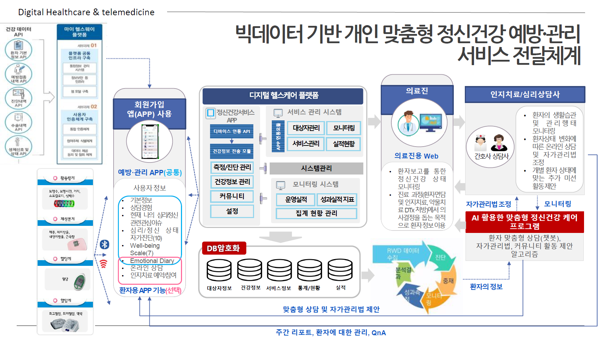

# 우울증 디지털 진단 및 인지행동치료 플랫폼 서비스 (HUNOMIND) 프로토타입 개발 프로젝트

* 한 줄 소개: 비대면 정신건강 관리를 위한 진단, 치료, 데이터 관리 기능의 앱/서버 프로토타입 개발 프로젝트
* 진행 및 참여기간: 2023/01/12
* 담당 부분: Android 앱 기능 구현, 데이터 파이프라인 설계, 백엔드 API 구축, 앱/서버 프로토타입 개발
* 분야: 데이터 파이프라인, 디지털 헬스케어, 모바일 앱 개발, 백엔드
* 성과 요약: End-to-End 서비스 개발 경험, 데이터 파이프라인 구축, 투자 유치용 프로토타입 확보
* 적용 skill 및 tools: AWS EC2, Django, Kotlin, MySql, RESTful API, python

## 📖 내용 요약

---

## 🧶 프로젝트 배경

비대면 정신건강 관리의 수요가 증가함에 따라, 환자와 의료진이 모바일 플랫폼을 통해 소통하고 데이터를 관리하는 통합 서비스 개발을 목표로 프로젝트를 시작했습니다. 특히, 정신건강 데이터가 실시간으로 생성되고 분석까지 이어지는 **데이터 파이프라인의 전체 설계와 구현이 필수적**이었습니다. 데이터 처리와 백엔드 개발 경험이 있는 제가 이 과정의 **설계부터 구현까지 주도적인 역할**을 맡아 프로젝트를 진행했습니다.

---

## 🔍 문제 정의

정신건강 관리의 연속성을 보장하기 위해, 환자와 의료진 간의 데이터 흐름을 원활하게 연결하는 시스템이 필요했습니다.  기능의 확장성을 고려하여 전체 시스템 구축이 필요한 상황이였습니다.

- **환자용 모바일 앱 개발**
    
    사용자가 매일 자신의 감정 상태를 기록(감정 다이어리)하고, 표준화된 정신건강 설문을 통해 자가 진단을 수행하며, 의료진과의 예약을 관리할 수 있는 안드로이드 앱 개발이 필요했습니다. 
    
- **의료진용 웹 서비스 연동**
    
    의료진이 환자의 설문 결과, 감정 다이어리 데이터 등을 웹 환경에서 안전하고 직관적으로 확인할 수 있는 시스템이 필요했습니다.
    
- **데이터 파이프라인 및 인프라 구축**
    
    앱과 웹에서 생성되고 조회되는 데이터를 안정적으로 저장, 관리, 연결하기 위한 백엔드 API 구축이 필요했습니다. 특히, 리눅스 서버만 있는 상태에서 서비스 운영에 필요한 전체 환경을 구성하는 것도 주요 과제였습니다.
    

---

## 🔧 문제 해결 방식

- **안드로이드 앱 개발 및 기능 구현 (Fronted)**
    
    기획팀의 Figma 디자인을 기반으로 `Kotlin`을 사용하여 로그인, 설문, 감정 다이어리 등 핵심 기능을 구현하며 사용자 데이터가 생성되는 시작점을 개발했습니다.
    
- **Django 기반 백엔드 시스템 구축 (Backend)**
    
    수집된 데이터는 향후 **복잡한 시계열 분석이나 AI 기반 예측 모델의 핵심 재료**가 될 것이라 판단했습니다. 따라서 데이터 분석 라이브러리와의 호환성이 뛰어난 **Python 기반의** `Django`**를 전략적으로 선택**하여 `RESTful API` 서버를 구축했습니다.
    
- **데이터베이스 설계 (Database)**
    - 사용자의 감정 데이터, 설문 응답 등 **다양한 형태의 데이터를 효율적으로 저장하고 조회**할 수 있도록, **정규화를 고려하여** `MySQL` **데이터베이스 스키마를 직접 설계**하고 구축했습니다.
- **서비스 운영 환경 구축 (Infrastructure)**
    - Linux 서버 환경에서 `Nginx`(웹 서버)를 직접 설정하고, `AWS EC2` 인스턴스를 활용하여 프로토타입 배포를 진행하며 전체 서비스 운영 및 배포 프로세스를 경험했습니다.

---

## 📄 결과

- **실시간 데이터 파이프라인 프로토타입 구축**
    
    환자의 모바일 앱에서 생성된 데이터가 Django 서버를 거쳐 MySQL DB에 안정적으로 저장 및 관리되는 **End-to-End 데이터 흐름의 프로토타입을 성공적으로 구축**했습니다.
    
- **핵심 앱 기능 구현 및 프로토타입 완성**
    
    로그인, 설문지, 감정 다이어리 등 기획된 주요 기능 개발을 완료하여 실제 작동하는 프로토타입을 완성했습니다.
    
- **프로토타입의 대외 활용 및 가치 입증**
    
    개발된 프로토타입은 기관의 투자 유치를 위한 **학회 부스 시연에 활용**되어 프로젝트의 기술적 가치를 입증했습니다.
    

---

## 🛠️ 적용 skills 및 tools

- **App Development**: `Kotlin`, `Android Studio`
- **Backend**: `Django (Python)`, `RESTful API`
- **Database**: `MySQL`
- **Infrastructure & Deployment**: `AWS EC2`, `Nginx`

---

## 💡 후기

- **서비스 전체 구조에 대한 이해**
    
    데이터를 분석하고 모델링하는 것을 넘어, 데이터가 사용자단에서 생성되어 저장 및 활용되는 **서비스의 전체 구조와 데이터 흐름을 깊이 이해**할 수 있었습니다.
    
- **다양한 기술 스택 습득 및 적용**
    
    각 분야의 전문적 수준은 아니지만 Kotlin, Django, MySQL, AWS 등 **새로운 기술을 빠르게 학습하고 적용**하며 데이터 기반의 문제를 해결하는 종합적인 역량을 향상시켰습니다.
    
- **부서 간 협업의 중요성**
    
    기획, 개발, 분석 팀 간 **원활한 소통과 협업의 중요성**을 체감, 현업 요구사항 파악 및 소통 역량의 필수임을 깨달았습니다.
    

---

## 🔗 관련 링크
- [**학회 부스 관련 기사**](https://zdnet.co.kr/view/?no=20231002094612)
